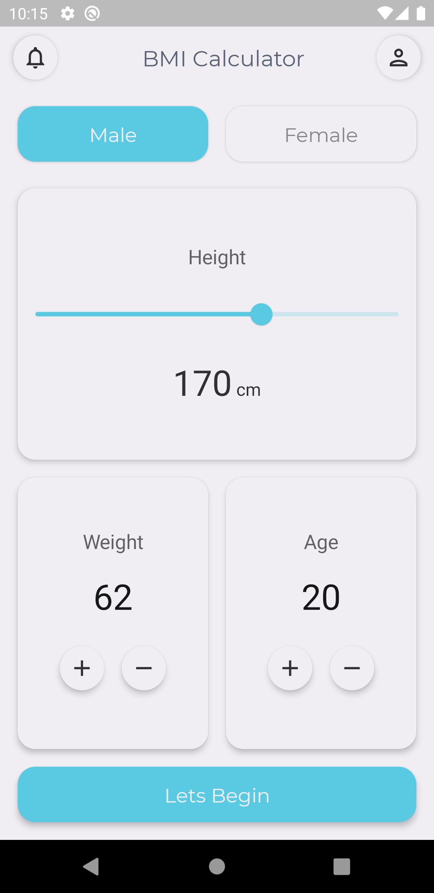
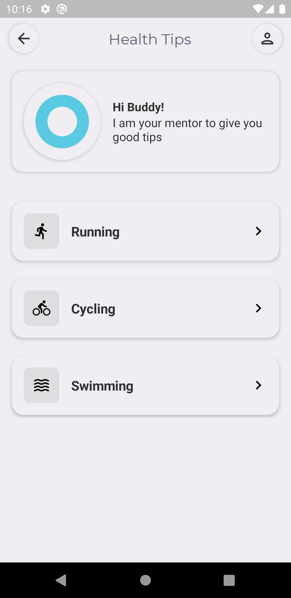
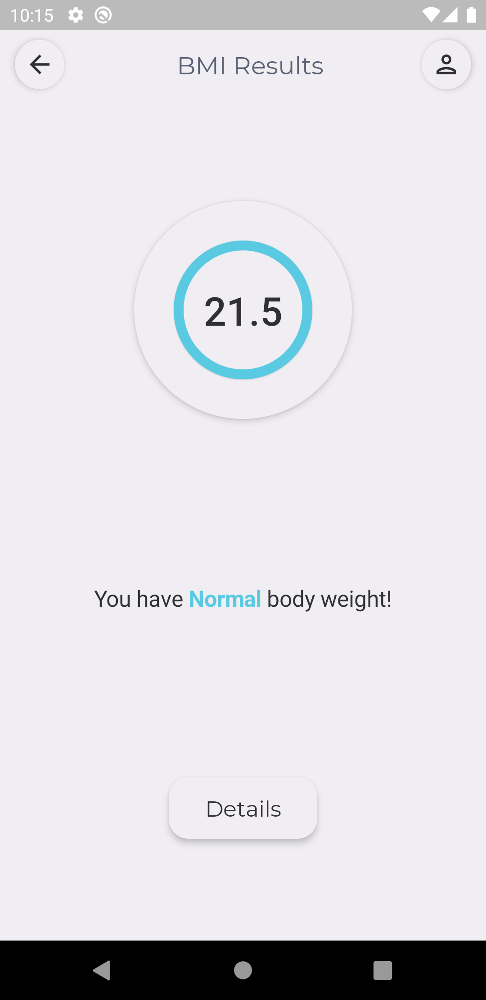
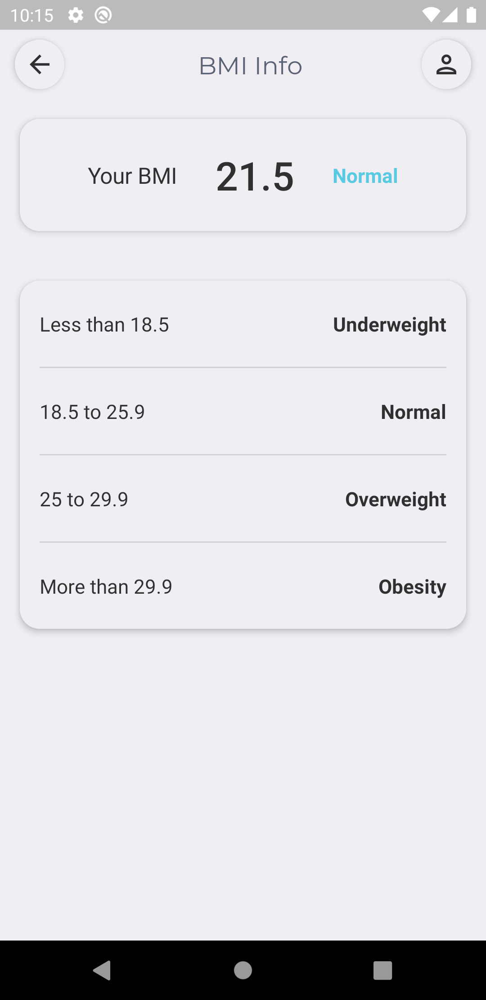

# BMI-calculator
Jetpack Compose app based on inspiration from the flutter app [BMI-Calculator](https://github.com/alirzadev/BMI-Calculator)

## Development Tools
- [Android Studio Canary](https://developer.android.com/studio/preview)
- [Jepack Compose](https://developer.android.com/jetpack/compose)
- Compose Version : **0.1.0-dev12**
- Material Icons : `implementation("androidx.ui:ui-material-icons-extended:$compose_version")`

## Brief Introducation
This application is developed to introduce basic UI design using Jetpack Compose. Though compose is still in development stage, it is powerful and complex UIs can be created in short durations. This example application extensively uses Rows and Columns for generating UIs.

Some of the components used in this application are listed below:
- Text
- Column
- Row
- Slider
- Vertical Scroller
- Toolbar [Customized TopAppBar]
- RoundIconButton [Custom View: Icon inside Card]
- RoundedCard [Card with corner radius]
- RoundedButton [Button with corner radius]
- RoundToggleButton [For Gender Selection]

Since proper screen navigation is not yet recommended by the compose development team, I had used `@Model` as used in [JetNews](https://github.com/android/compose-samples/tree/master/JetNews). But `@Model` is deprecated in `dev12` in favour of `state` variants, one of which is also used to observe the values changed for age, weight and height in this application too.

## Code Link to Main Screens
- [Home](/app/src/main/java/com/github/sagar2093/bmicompose/ui/HomeScreen.kt)
- [Health Tips](/app/src/main/java/com/github/sagar2093/bmicompose/ui/TipsScreen.kt)
- [BMI Result](/app/src/main/java/com/github/sagar2093/bmicompose/ui/ResultScreen.kt)
- [BMI Info](/app/src/main/java/com/github/sagar2093/bmicompose/ui/TipsScreen.kt)

## Screenshots

<table>
 <tr>
    <td>
    <td>
 </tr>
 <tr>
    <td>
    <td>
  </tr>
 </table>

 ## App Inspiration
Flutter App by [Ali Raza](https://github.com/alirzadev): 
- https://github.com/alirzadev/BMI-Calculator

Dribble Design by [Kevin Al-Rizal](https://dribbble.com/uiwithvin):
- https://dribbble.com/shots/11368106-BMI-Calculator-App-Neumorphism
